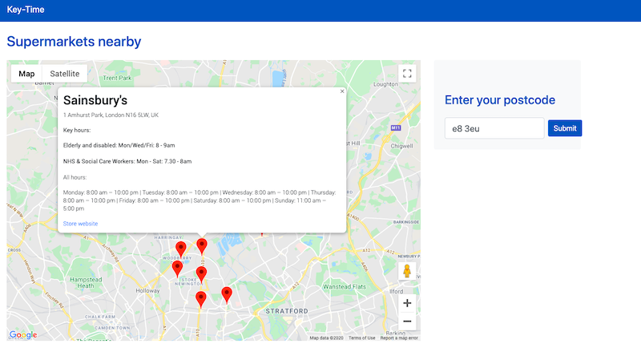

***
⚠️⚠️⚠️
> When Heroku became paywalled, we decided to decommission the site. You can still explore the code and see how it used to look below.

⚠️⚠️⚠️
***

# Hack For Heroes Hackathon (1 - 3 June 2020) - Team Groceries 🛒

[Objective](#objectives) | [Collaborators](#collaborators) | [Planning](#planning) | [User Stories](#user_stories) | [MVP](#MVP) | [Running the program](#running_the_program) | [Testing](#testing) | [Technologies](#technologies) | [Further work](#further_work) 

Check it out live, [right here](http://hfh-groceries.herokuapp.com/)!!

## <a name="objectives">Objectives</a>

Create an app which provides frontline workers and at-risk individuals with the open times devoted purely to them at their nearest supermarket, combining information from major supermarkets in one place.

## <a name="collaborators">Collaborators</a>

- [Srikaanth Balajhi](https://github.com/srikaanthtb)
- [Sophia Bell](https://github.com/Kittaru87)
- [Josh Blumberg](https://github.com/jlblumberg)
- [Ilias Grigoropoulos](https://github.com/IliasMariosG)
- [Haydon Houghton](https://github.com/Kefuri)
- [Kehinde Peter Olofinmoyin](https://github.com/KOlofinmoyin)
- [Jason Wong](https://github.com/jasylwong)
- [Emily Wright](https://github.com/EWright212)
- [Liz Daly](https://github.com/lookupdaily)

## <a name="planning">Planning</a>

- [Miro MVP board](https://miro.com/app/board/o9J_kr0yDm4=/)
- [Invision wireframes](https://jason842465.invisionapp.com/freehand/hfh-groceries-K7tpa9Jf9?v=vjZVtVETrCEbCjPjKYYovg%3D%3D&linkshare=urlcopied)

## <a name="user_stories">User stories</a>

```
As an NHS/key worker/vulnerable person,
so that I can find the best time to shop
I want to see when my local supermarket's special hours are
```
```
As an NHS/key worker/vulnerable person,
so that I can find the closest place to shop
I want to see where my local supermarkets are (based on postcode) on a map
```
```
As a NHS/key worker/vulnerable person
So that I can show off my project
I would like to be able to see the information on a publicly accessible site
```

## <a name="MVP">MVP</a>

Our MVP will include the following features:

- Ability to input your postcode as a search parameter
- Nearby shops will appear on a map with a pin that when clicked will show the relevant information
- Sainsburys selected as a proof of concept, to be expanded in future work
- Relevant information:
  - Display all opening hours for selected shop 
  - Display the hours the shop is open for NHS/key workers/vulnerable individuals

### App in action



Check it out live at [hfh-groceries.herokuapp.com](http://hfh-groceries.herokuapp.com/)

## <a name="running_the_program">Running the program</a>

### Setup
```
$ git clone https://github.com/jlblumberg/hfh-groceries.git
$ cd hfh-groceries
$ bundle install
$ yarn install
$ touch .env
```
You will then have to add a MAPS_API_KEY to the .env file with a valid Google API key. 

## <a name="testing">Testing, code coverage, and code style</a>
```
$ rspec 
$ rubocop # TBC
```

## <a name="technologies">Technologies Used</a>

- Ruby on Rails
- Javascript
- Webpack
- Google Maps API libraries: Maps, Places, Geocoder

## <a name="further_work">Further work</a>

- Expand app to show further supermarket chains on search
- Geolocation option to search for supermarkets near your current location
- Shop information displayed as a text list for improved user experience, and to ensure data is accessible to screen readers
- Search for nearby supermarkets is performed dynamically when the map changes or a user searches for a different location
